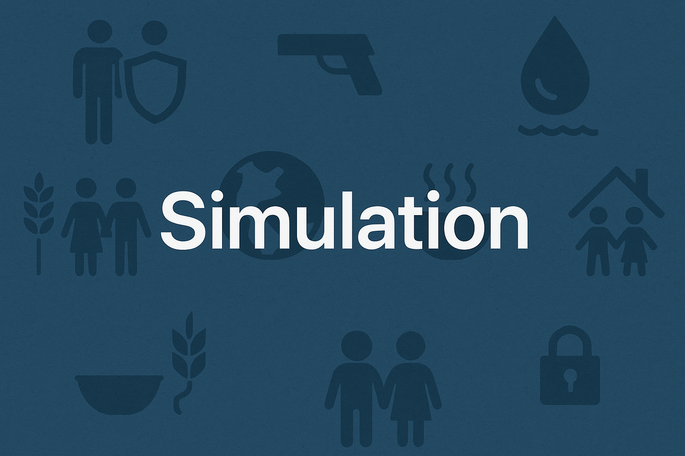

# ⚡ Critical Response: Securing NOVA’s Grid

> _A cybersecurity simulation where participants respond to a grid-wide blackout caused by a coordinated cyberattack on Northern Virginia’s critical infrastructure._

---

This simulation immerses participants in a high-stakes cyber crisis inspired by real-world events like the Colonial Pipeline ransomware breach and Ukraine’s grid hacks.

Participants take on stakeholder roles to:

- ⚙️ Restore infrastructure and public order  
- 📢 Manage disinformation and civil unrest  
- 🧭 Make difficult ethical and political decisions  
- 🔐 Build long-term digital resilience  

---

## 🗂 Quick Access

- [📖 Scenario Background](scenario.md)
- [🧑‍💼 Stakeholder Roles](roles.md)
- [🧪 Simulation Walkthrough](guide.md)
- [🎓 Facilitator Instructions](facilitator.md)
- [📊 Evaluation Criteria](evaluation.md)
- [❓ FAQs](faq.md)
- [📚 Resources](resources.md)
- [📄 User Manual](manual.md)

---

### 🚀 Ready to Jump In?

Begin your mission here:  
[**Start Simulation Walkthrough →**](guide.md)

---

### 👥 Team Credits

Dharam Bhayani • Avichal Sharma • Aryan Jain  
Virginia Tech – Future of Security – Spring 2025
